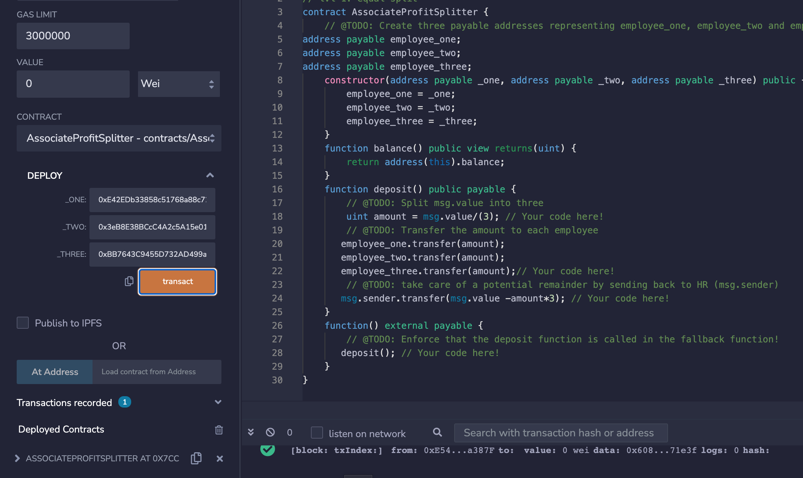
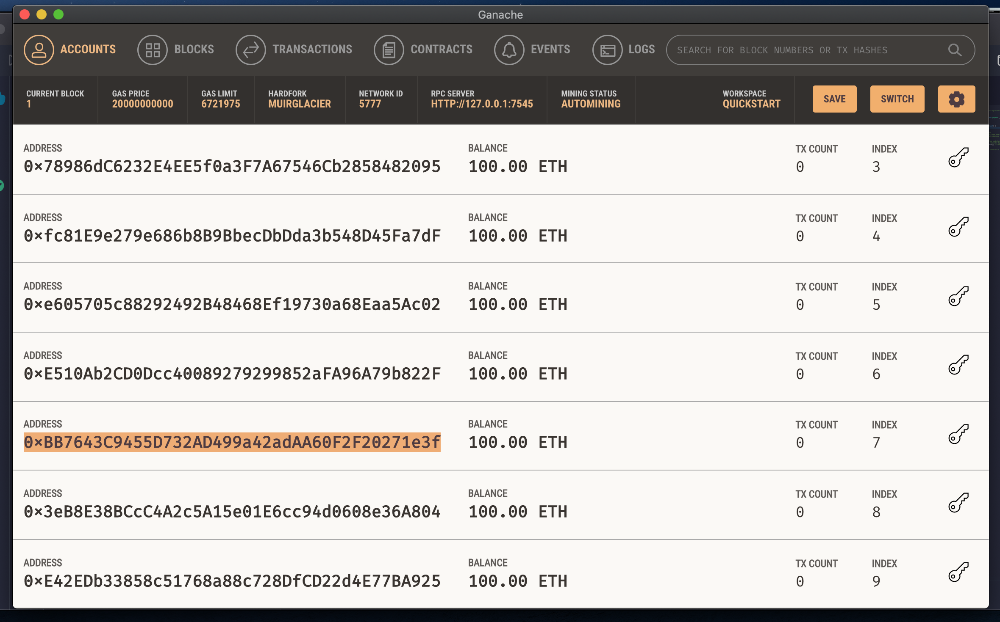
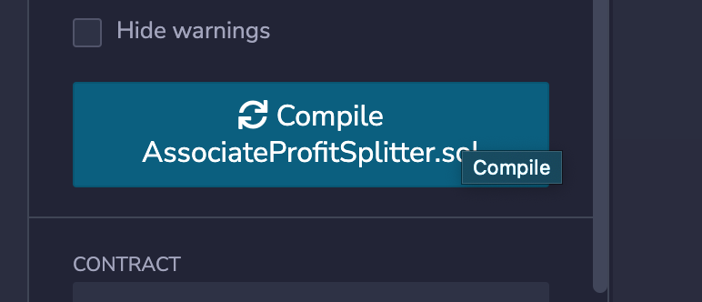
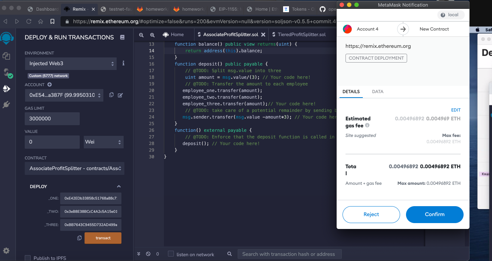
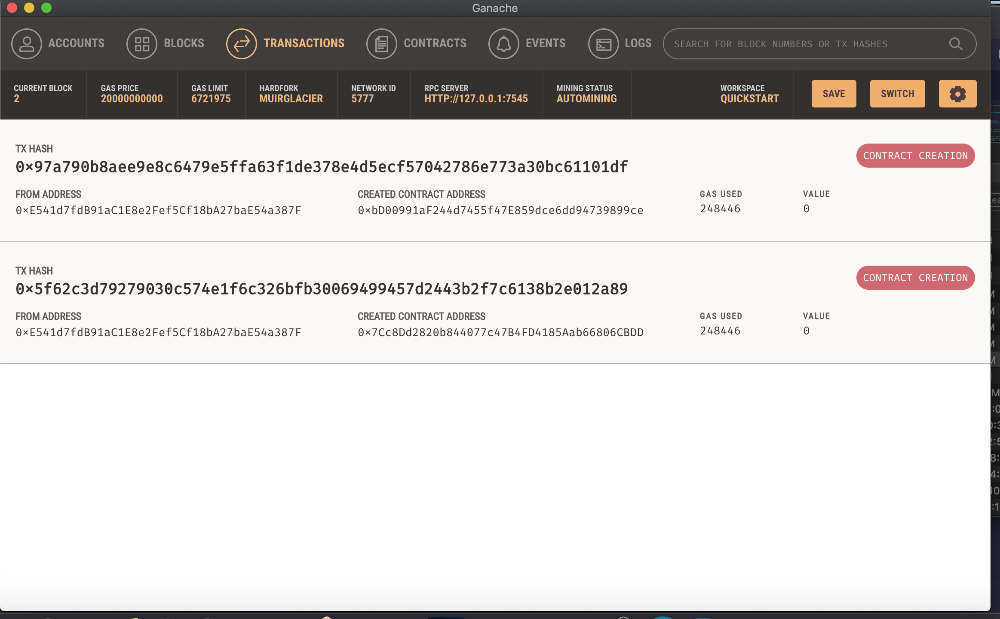
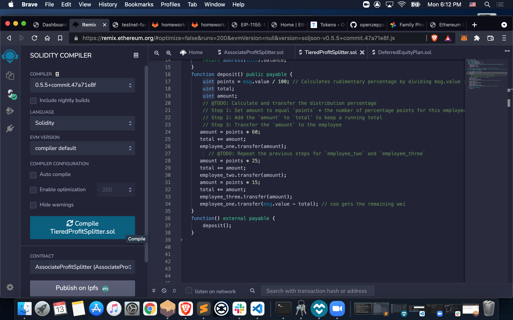
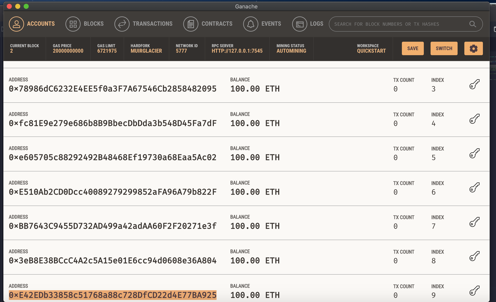
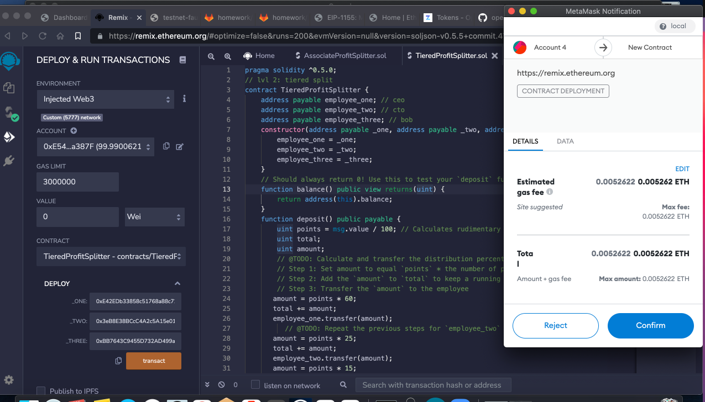
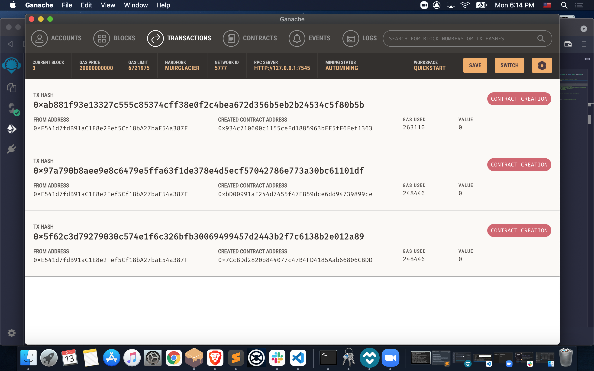

# Solidity
Homework for Solidity

# Associates Profit Splitter

### After coding is complete…

### choose the appropriate addresses

### Compile the code…

### Approve the transaction

### Double check the addresses, amount, ect. and click 'confirm' to send the transaction.

### Check the transaction history to confirm the contract was created successfully

# Tiered Profit Splitter

### After coding is complete…

### choose the appropriate addresses

### paste the appropriate addresses

### Compile the code…

### Approve the transaction

### Double check the addresses, amount, ect. and click 'confirm' to send the transaction.

### Check the transaction history to confirm the contract was created successfully

