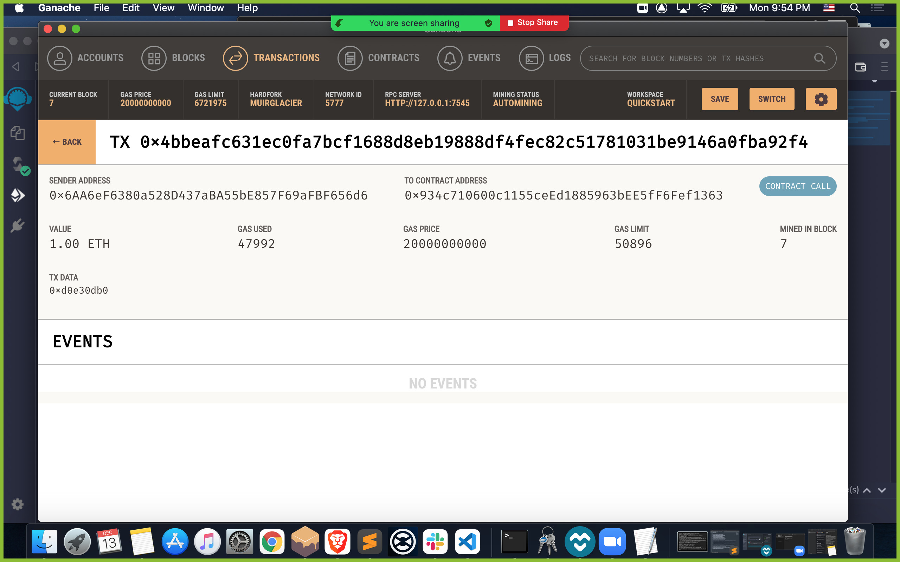
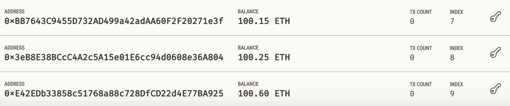

# Associates Profit Splitter

## After coding is complete…

## Choose the appropriate addresses...

## Compile the code…

## Approve the transaction...

## Double check the addresses, amount, ect. and click 'confirm' to send the transaction.

## Finally, Check the transaction history to confirm the contract was created successfully!

 
 

# Tiered Profit Splitter
 
 

## After coding is complete…

## Choose the appropriate addresses

## Paste the appropriate addresses

## Compile the code…

## Approve the transaction...

## Double check the addresses, amount, ect. and click 'confirm' to send the transaction.

## Check the transaction history to confirm the contract was created successfully.

## deploy the payment to the tiers.

## Check the transaction history to confirm the splits were sent accordingly.

